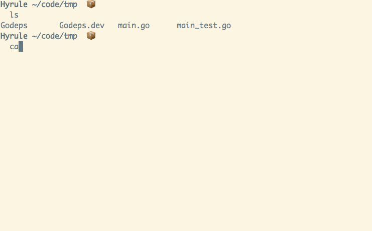

# gpm-all

gpm-all is a [gpm](https://github.com/pote/gpm) plugin that runs all Godeps files in the current directory, this is done so developers can have a Godeps, Godeps.dev, or any other kind of separation they choose in their dependencies.

```bash
USAGE
      $ gpm all           # Downloads all external top-level packages required by
                          # your application and generates a Godeps file with their
                          # latest tags or revisions.
      $ gpm all version   # Prints version information for the plugin.
      $ gpm all help      # Prints this message.
```

Requires [gpm v1.1.1](https://github.com/pote/gpm/releases/tag/v1.1.1) which introduces gpm plugins.

## Usage



## Installation

### With Homebrew

```bash
$ brew tap pote/gpm_plugins
$ brew install gpm-all
```

### Manually in *nix

```bash
$ git clone git@github.com:pote/gpm-all.git && cd gpm-all
$ ./configure
$ make install
```
